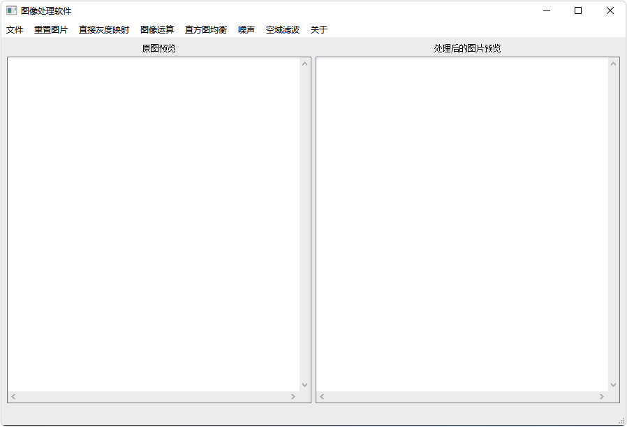
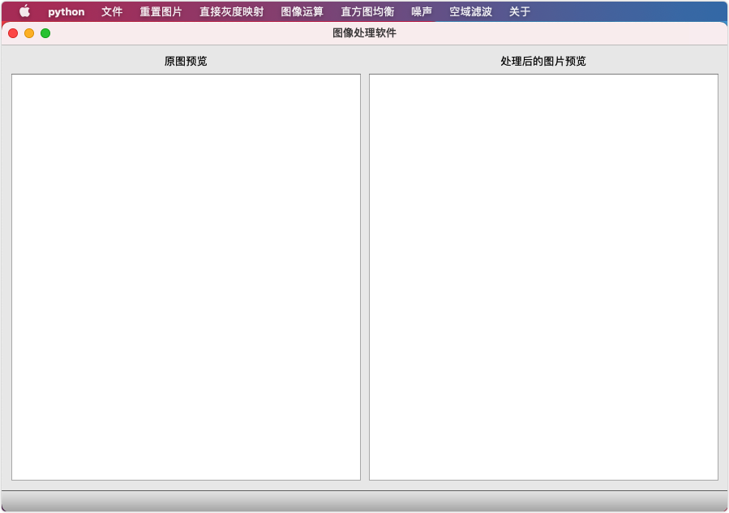

# ImageProcessor
基于PyQt+OpenCV的图像处理软件
### 效果预览


### 环境搭建
Python3.8 + PyQt5 + opencv-python + matplotlib
#### 安装Python
Linux:<br>
```
apt install python3.8 
```
或者
```
yum install python3.8
```
Windows：直接拿exe安装，记得加系统环境path
#### 安装依赖库
```
pip install PyQt5
pip install opencv-python
pip install matplotlib
```
